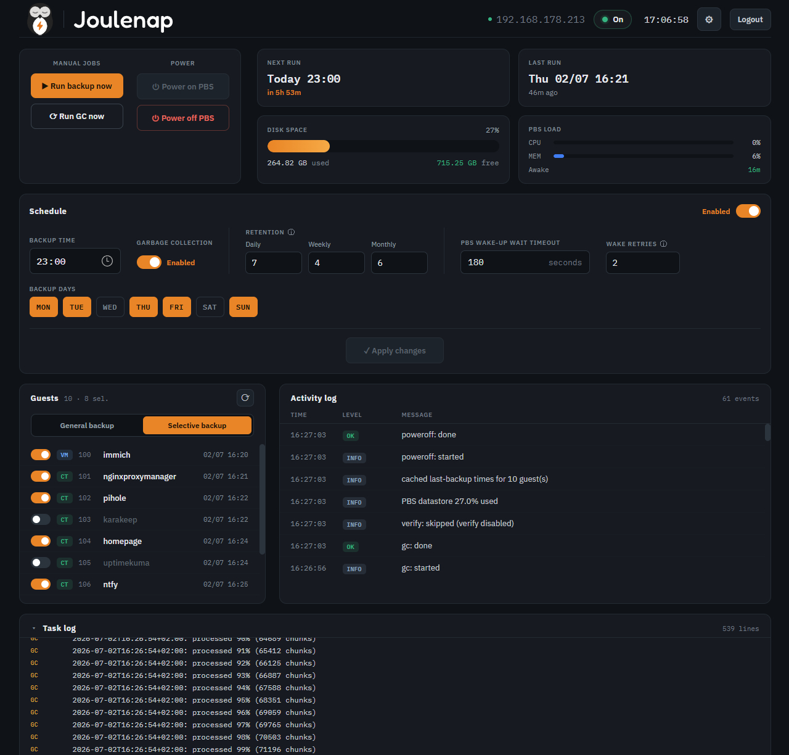
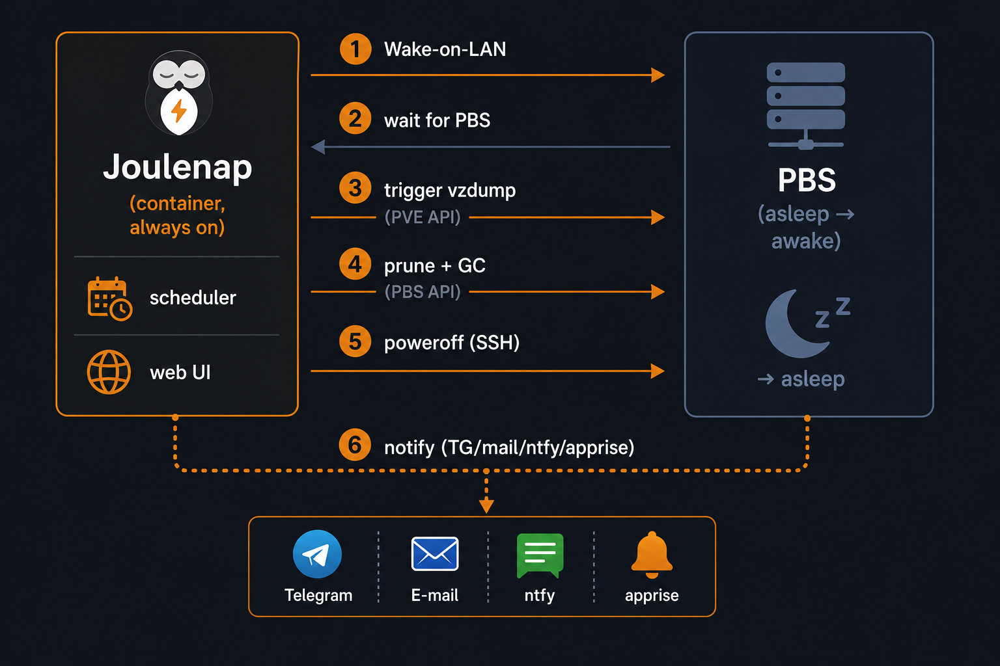
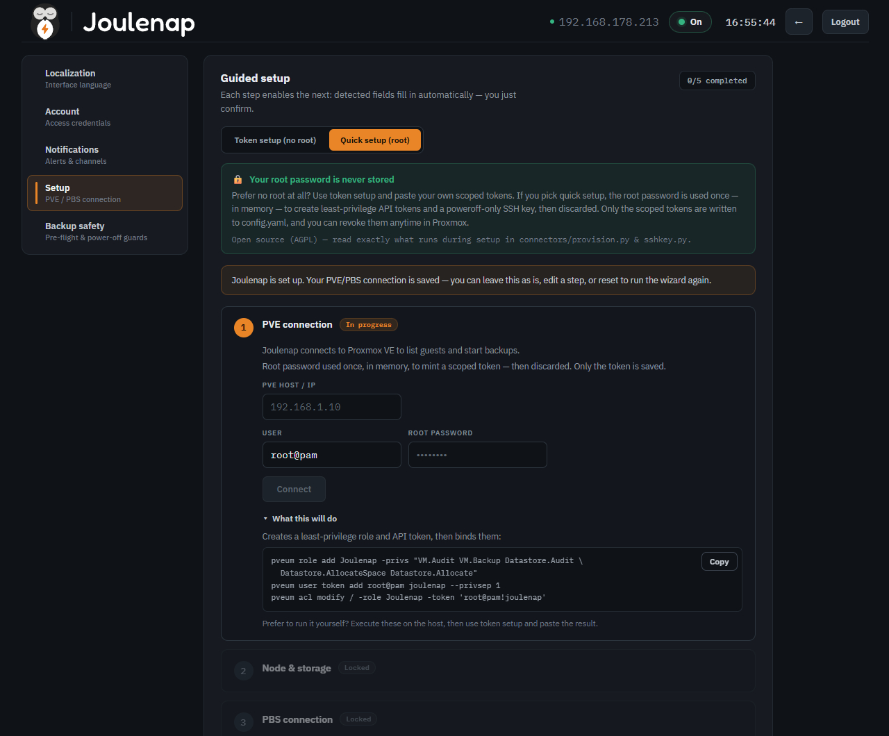

<p align="center">
  <picture>
    <source media="(prefers-color-scheme: dark)" srcset="assets/lockup-dark.svg">
    
  </picture>
</p>

<p align="center">
  <em>Your Proxmox backup server sleeps. <strong>Joulenap</strong> wakes it, runs the backup, and tucks it back in.</em>
</p>

<p align="center">
  <a href="https://github.com/Joulenap/joulenap/actions/workflows/ci.yml"></a>
  <a href="LICENSE"></a>
  <a href="https://hub.docker.com/r/catubba/joulenap"></a>
</p>

Joulenap is a small self-hosted **web UI + scheduler** that runs automated Proxmox VE backups to a **Proxmox Backup Server (PBS) that stays powered off** most of the time. At the scheduled hour it wakes the PBS over the network (Wake-on-LAN), runs the backup, applies retention and garbage collection, powers the PBS back down, and notifies you — so you get off-site, deduplicated backups **without keeping a second machine running 24/7**.

The name says it: a *joule* saved, while your backup server takes a *nap*. 💤

---

## Why

A dedicated PBS box is the right way to keep backups on separate hardware (3-2-1 rule), but leaving it on 24/7 wastes power for a job that runs a few minutes a night. Proxmox's built-in scheduled backups assume the target is always reachable, so they can't drive a "wake → backup → sleep" cycle.

Joulenap fills that gap with a friendly UI: pick the time, pick which guests to back up, and forget it.




## How it works

<center></center>

Joulenap **owns the schedule** itself (internal scheduler), so nothing on the Proxmox host needs to be modified. It talks to PVE and PBS through their **APIs** (scoped tokens) and uses a single **SSH** command only for the PBS power-off, which has no API.

## Features

- ⏰ Web UI scheduler: choose backup time, enable/disable, see next/last run
- 🔌 Wake-on-LAN of the PBS, with readiness wait and timeout
- 🗂️ Per-guest selection (toggle which CTs/VMs to back up, or "all + auto-include new")
- ♻️ Retention (daily/weekly/monthly) and scheduled Garbage Collection
- 🔔 Notifications: Apprise, Telegram, ntfy, Discord, email — on success and/or failure
- 📜 Live log viewer and manual "Run backup now" / "Run GC now"
- 📊 Dashboard integration: expose backup status to Homepage, Homarr, Dashy or Glance — see [`docs/INTEGRATIONS.md`](docs/INTEGRATIONS.md)
- 🌍 Multi-language UI
- 🔒 Login-protected; secrets kept out of the repo

## Status

**v0.2.0.** Feature-complete: scheduler + Wake-on-LAN + vzdump + retention + GC + verify +
notifications + setup wizard, packaged as a Docker image — with transport hardening (PBS TLS
pinning + SSH host-key verification) and auth hardening (login rate-limit, session hardening).
Adds a read-only [dashboard integration](docs/INTEGRATIONS.md) (Homepage/Homarr/Dashy/Glance) and
persistent datastore usage shown even while the PBS is powered off.
See [`docs/ARCHITECTURE.md`](docs/ARCHITECTURE.md) for the design and API.

## Quick start (Docker)

One command — no files to download, no config to edit first. The container creates its own config on
first run and you fill it in through the web wizard:

```bash
mkdir -p /opt/joulenap/data

docker run -d --name joulenap \
  --restart unless-stopped \
  --network host \
  -e TZ=Etc/UTC \
  -v /opt/joulenap/data:/app/data \
  catubba/joulenap:latest
# then open http://<host-ip>:8080
```

`--network host` lets Joulenap send the Wake-on-LAN magic packet on your LAN broadcast; the single
`data` directory persists config, history, logs and the SSH key across updates. You pick your
**timezone on the first-run screen** (pre-detected from your browser), so the `TZ` above is just a
neutral default. Prefer Compose? See [`docker-compose.example.yml`](docker-compose.example.yml).

📖 **Full guide:** [`docs/INSTALL.md`](docs/INSTALL.md) walks a **Proxmox LXC** install from scratch
(create the container → install Docker → run Joulenap), plus Docker Compose and a native no-Docker
install, timezone, and first-run setup. Every config field is documented in
[`config.example.yaml`](config.example.yaml).

## Configuration



All settings live in `config.yaml` (see [`config.example.yaml`](config.example.yaml) for every field, grouped and commented). You normally never touch it by hand — the container creates it on first run inside the mounted `data/` directory, and the **setup wizard** fills it in. Secrets (API tokens, SSH key, bot token) stay in that `config.yaml`; the repo's copy is **git-ignored** so it's never committed.

## Security

Joulenap can trigger backups and power machines on/off, so treat it as privileged:

- Use **scoped API tokens** for PVE (Audit + Backup) and PBS, not root passwords.
- The SSH key to PBS should be dedicated and, ideally, restricted to the power-off command.
- **PBS API is TLS-pinned**: calls to PBS are pinned to its certificate fingerprint (captured at setup), so a swapped/MITM cert is rejected; a legitimately renewed cert is accepted after you re-run PBS detection in the wizard.
- **PBS SSH host key is verified**: confirmed once during setup and stored in `data/known_hosts`; later power-off/GC connections verify against it. Details in [`docs/CONFIG-WIZARD.md`](docs/CONFIG-WIZARD.md#security).
- Keep the UI on your LAN/VPN and behind its login. Don't expose it to the internet.
- `config.yaml` holds secrets — keep its file permissions tight and out of version control.
- **Login lockout**: after 5 failed login attempts from an IP address, that IP is locked out for 5 minutes (protects against online brute-force attacks).
- **Password floor**: admin passwords must be at least 8 characters.
- **Session cookie** (`app.session` in config): set `https_only: true` when serving Joulenap over HTTPS or behind a TLS-terminating proxy; `max_age_days` controls session lifetime (default 14 days). Changing the admin password immediately invalidates all existing sessions.
- **First-run setup**: complete the initial account setup promptly — the setup endpoint remains open until an account is created (and is rate-limited for security).

## Roadmap

- [✅] v0.1: scheduler + WoL + vzdump + retention + notifications + web UI
- [✅] Garbage Collection scheduling and verify jobs
- [✅] Per-guest last-backup status from PBS
- [ ] RTC-wake option (BIOS alarm) as an alternative to WoL
- [ ] Multiple PBS targets / off-site sync

## License

Licensed under the **GNU Affero General Public License v3.0** (AGPL-3.0). See [`LICENSE`](LICENSE).

## Disclaimer

Joulenap is an independent open-source project and is **not affiliated with, sponsored by, or endorsed by Proxmox Server Solutions GmbH**. "Proxmox" is a trademark of its respective owner; it is used here only to describe compatibility.
