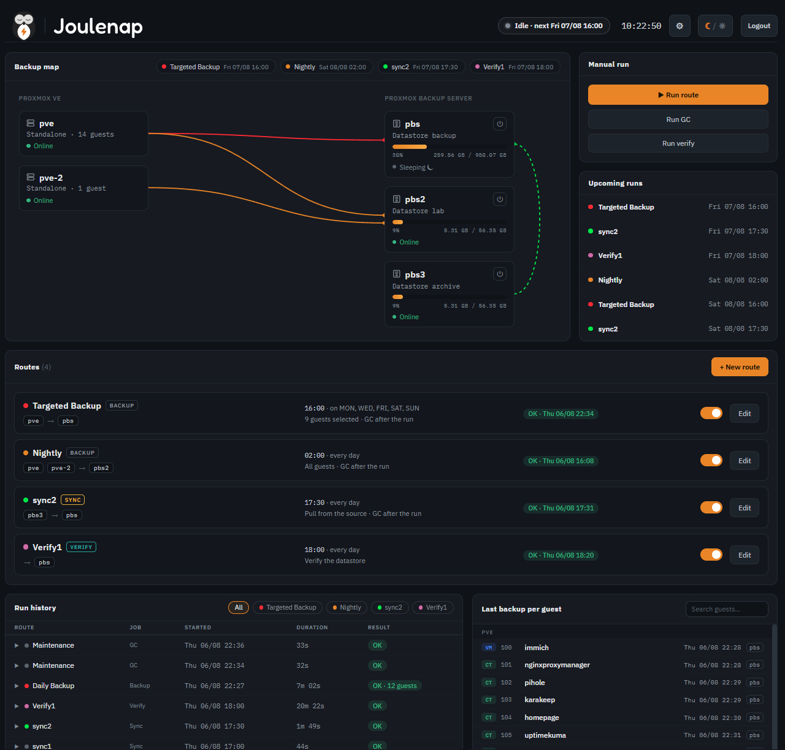
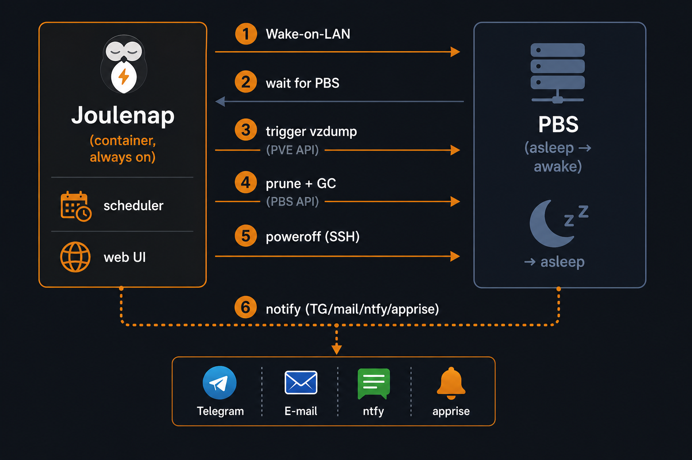
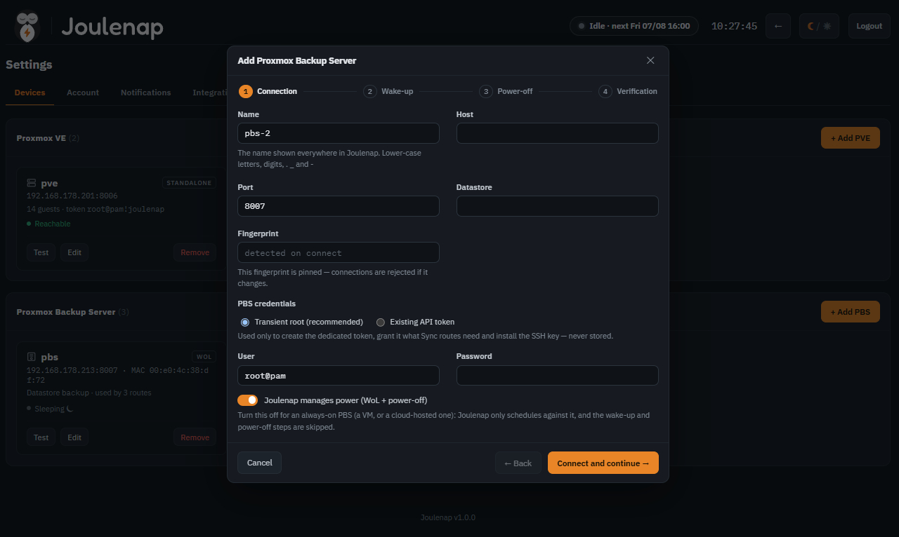

<p align="center">
  <picture>
    <source media="(prefers-color-scheme: dark)" srcset="assets/lockup-dark.svg">
    
  </picture>
</p>

<p align="center">
  <em>Your Proxmox backup servers sleep. <strong>Joulenap</strong> wakes them, runs the backups, and tucks them back in.</em>
</p>

<p align="center">
  <a href="https://github.com/Joulenap/joulenap/actions/workflows/ci.yml"></a>
  <a href="LICENSE"></a>
  <a href="https://hub.docker.com/r/catubba/joulenap"></a>
</p>

Joulenap is a small self-hosted **web UI + scheduler** that runs automated Proxmox VE backups to **Proxmox Backup Servers (PBS) that stay powered off** most of the time. At the scheduled hour it wakes the backup server over the network (Wake-on-LAN), runs the job, applies retention and garbage collection, powers it back down, and notifies you — so you get deduplicated backups **without keeping a second machine running 24/7**.

You describe your setup as **routes**: which Proxmox hosts back up to which backup server, on what schedule, with what retention. A route can fan several PVE hosts into one PBS, or copy one PBS to another for a genuinely off-site second copy — and Joulenap wakes and sleeps every box each route touches, in the right order.

The name says it: a *joule* saved, while your backup server takes a *nap*. 💤

---

## Why

A dedicated PBS box is the right way to keep backups on separate hardware (3-2-1 rule), but leaving it on 24/7 wastes power for a job that runs a few minutes a night. Proxmox's built-in scheduled backups assume the target is always reachable, so they can't drive a "wake → backup → sleep" cycle. Neither can they drive one for a *second* backup server that only comes up once a week to take an off-site copy.

Joulenap fills that gap with a friendly UI: draw the routes, pick the times, pick which guests go where, and forget it.




## How it works

<center></center>

Joulenap **owns the schedule** itself (internal scheduler), so nothing on the Proxmox host needs to be modified. It talks to every PVE and PBS through their **APIs** (scoped tokens, one per device) and uses a single **SSH** command only for the power-off, which has no API.

## Features

- 🔀 **Routes**: any number of Proxmox hosts and backup servers, wired together explicitly — fan several PVEs into one PBS, or copy one PBS to another (**off-site sync**, pull or push)
- ⏰ A schedule per route, with its own retention, guest selection and options — plus a global pause switch
- 🔌 Wake-on-LAN of every backup server a route touches, with readiness wait, retries and timeout; boxes you keep always on are supported too
- 🧵 One run at a time, the rest queued — and a box stays awake between two runs that both need it instead of being woken twice
- 🗂️ Per-source guest selection: back up **all** guests of a host (new ones included automatically) or an explicit **include** list
- ♻️ Retention (last/daily/weekly/monthly/yearly), plus optional Garbage Collection and verification after a route runs
- 👀 **External schedules**: a route kind that starts nothing of its own — PVE/PBS run their own jobs, Joulenap just wakes the box, watches the tasks and powers it off when they go quiet
- 🔔 Notifications: Apprise, Telegram, ntfy, Discord, email — on success and/or failure, per route
- 📜 Live log viewer, run history with a per-step timeline, live PVE/PBS task output, and manual runs — per route, or an ad-hoc GC/verify on one box — stoppable mid-run
- ⚙️ Advanced settings tab with a built-in `config.yaml` editor, plus an opt-in update check
- 📊 Integrations: backup status for Homepage, Homarr, Dashy or Glance, plus a Prometheus `/metrics` endpoint for Grafana (alert when a guest stops being backed up) — see [`docs/INTEGRATIONS.md`](docs/INTEGRATIONS.md)
- 🌍 Multi-language UI
- 🔒 Login-protected; secrets kept out of the repo

## Status

**v1.0.0.** Built around routes over any number of PVE and PBS devices: backup, PBS→PBS sync,
external-schedule watching and verification, driven by a run queue and a per-server power lease
so a box is woken once and slept once no matter how many routes need it. Packaged as a Docker
image, with transport hardening (per-device PBS TLS pinning + SSH host-key verification) and auth
hardening (login rate-limit, session hardening). Includes guided wizards for adding a PVE or a
PBS, run history with a per-step timeline and live task output, the ability to stop a run
mid-flight, [integrations](docs/INTEGRATIONS.md) for dashboards (Homepage/Homarr/Dashy/Glance)
and Prometheus, persistent datastore usage shown even while a server is powered off, a
per-channel notification test report, and a responsive UI that works on a phone.
See [`docs/ARCHITECTURE.md`](docs/ARCHITECTURE.md) for the design and API.

**Upgrading from 0.9?** Your `config.yaml` is converted automatically on the first start — see
[Upgrading](#upgrading-from-09) below before you pull.

## Quick start (Docker)

One command — no files to download, no config to edit first. The container creates its own config on
first run and you fill it in through the web UI:

```bash
mkdir -p /opt/joulenap/data

docker run -d --name joulenap \
  --restart unless-stopped \
  --network host \
  -e TZ=Etc/UTC \
  -v /opt/joulenap/data:/app/data \
  catubba/joulenap:latest
# then open http://<host-ip>:8080
```

`--network host` lets Joulenap send the Wake-on-LAN magic packet on your LAN broadcast; the single
`data` directory persists config, history, logs and the SSH key across updates. You pick your
**timezone on the first-run screen** (pre-detected from your browser), so the `TZ` above is just a
neutral default. Prefer Compose? See [`docker-compose.example.yml`](docker-compose.example.yml).

📖 **Full guide:** [`docs/INSTALL.md`](docs/INSTALL.md) walks a **Proxmox LXC** install from scratch
(create the container → install Docker → run Joulenap), plus Docker Compose and a native no-Docker
install, timezone, and first-run setup. Every config field is documented in
[`config.example.yaml`](config.example.yaml).

## Configuration



All settings live in `config.yaml` (see [`config.example.yaml`](config.example.yaml) for every field, grouped and commented). You normally never touch it by hand — the container creates it on first run inside the mounted `data/` directory, and the **wizards** under **Settings → Devices → + Add** fill it in: one flow adds a Proxmox host and discovers the backup servers it already knows about, the other adds a backup server and sets up its wake-up and power-off. Routes are then drawn from the homepage. Secrets (API tokens, SSH key, bot token) stay in that `config.yaml`; the repo's copy is **git-ignored** so it's never committed.

## Upgrading from 0.9

Pull the new image and start it — nothing else. On the first start Joulenap converts your
`config.yaml` from the old single-PVE/single-PBS layout into devices and routes: your backup job
becomes a route named **Backup**, a scheduled verification becomes one named **Verify**, and your
schedule, guest selection and retention come across with them.

- **A copy of the old file is kept** as `config.yaml.pre-overhaul.bak` next to it, before anything
  is rewritten. If the conversion doesn't validate, Joulenap keeps running on your original file
  and says why in a banner rather than starting up looking empty.
- **One conversion is lossy, and it widens rather than narrows.** The old "back up all guests
  **except** these" mode no longer exists, so such a route becomes "all guests" — it will back up
  *more* than before, never less. Narrow it down from the route editor if that isn't what you
  want. It's the one thing worth checking after the upgrade.
- **Breaking for anything outside the UI**: `GET /api/dashboard` and `/metrics` changed shape,
  because there is no longer a single "next run" or "the datastore". Dashboard widgets and
  Grafana alerts built on 0.9 need updating — the field-by-field mapping is at the top of
  [`docs/INTEGRATIONS.md`](docs/INTEGRATIONS.md).

## Security

Joulenap can trigger backups and power machines on/off, so treat it as privileged:

- Use **scoped API tokens** for each PVE and each PBS, not root passwords — the exact privileges each one needs are listed in [`docs/ARCHITECTURE.md`](docs/ARCHITECTURE.md#permissions-cheat-sheet).
- The SSH key to a backup server should be dedicated and, ideally, restricted to the power-off command — the wizard offers exactly such a line.
- **Every PBS API connection is TLS-pinned** to that device's certificate fingerprint (captured at setup), so a swapped/MITM cert is rejected; a legitimately renewed cert is accepted after you re-run that device's connect step in the wizard.
- **Every PBS SSH host key is verified**: confirmed once during setup and stored in `data/known_hosts`; later power-off connections verify against it. Details in [`docs/CONFIG-WIZARD.md`](docs/CONFIG-WIZARD.md#security).
- Keep the UI on your LAN/VPN and behind its login. Don't expose it to the internet.
- `config.yaml` holds secrets — keep its file permissions tight and out of version control.
- **Login lockout**: after 5 failed login attempts from an IP address, that IP is locked out for 5 minutes (protects against online brute-force attacks).
- **Password floor**: admin passwords must be at least 8 characters.
- **Session cookie** (`app.session` in config): set `https_only: true` when serving Joulenap over HTTPS or behind a TLS-terminating proxy; `max_age_days` controls session lifetime (default 14 days). Changing the admin password immediately invalidates all existing sessions.
- **First-run setup**: complete the initial account setup promptly — the setup endpoint remains open until an account is created (and is rate-limited for security).

## Roadmap

- [✅] v0.1: scheduler + WoL + vzdump + retention + notifications + web UI
- [✅] Garbage Collection after each backup, and scheduled verify jobs
- [✅] Per-guest last-backup status from PBS
- [✅] v1.0: multiple PVE and PBS devices, routes, and PBS→PBS off-site sync
- [ ] RTC-wake option (BIOS alarm) as an alternative to WoL
- [ ] Per-route notification routing (which channel hears about which route)

## License

Licensed under the **GNU Affero General Public License v3.0** (AGPL-3.0). See [`LICENSE`](LICENSE).

## Disclaimer

Joulenap is an independent open-source project and is **not affiliated with, sponsored by, or endorsed by Proxmox Server Solutions GmbH**. "Proxmox" is a trademark of its respective owner; it is used here only to describe compatibility.
